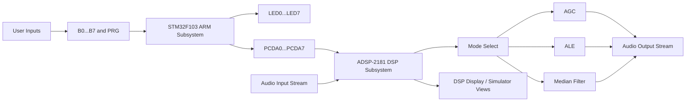

# System Graph

```mermaid
flowchart LR
    User[User Inputs]
    Buses[B0...B7 and PRG]
    STM32[STM32F103 ARM Subsystem]
    LedBus[LED0...LED7]
    CmdBus[PCDA0...PCDA7]
    DSP[ADSP-2181 DSP Subsystem]
    Mode[Mode Select]
    AGC[AGC]
    ALE[ALE]
    MF[Median Filter]
    AudioIn[Audio Input Stream]
    AudioOut[Audio Output Stream]
    Display[DSP Display / Simulator Views]

    User --> Buses
    Buses --> STM32
    STM32 --> LedBus
    STM32 --> CmdBus
    CmdBus --> DSP
    AudioIn --> DSP
    DSP --> Mode
    Mode --> AGC
    Mode --> ALE
    Mode --> MF
    AGC --> AudioOut
    ALE --> AudioOut
    MF --> AudioOut
    DSP --> Display
```
