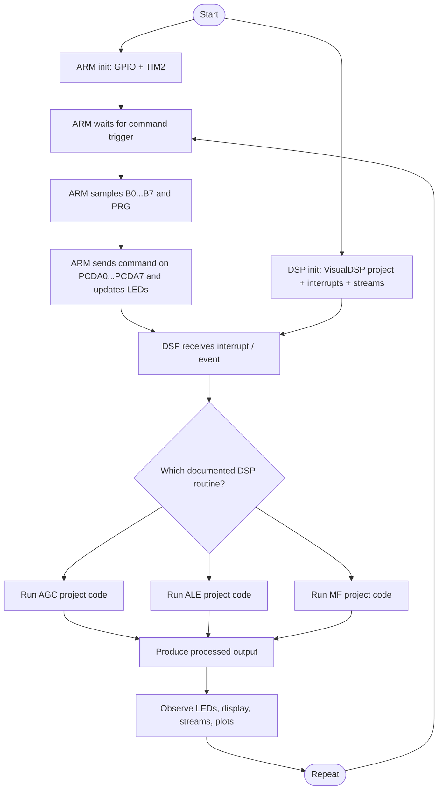

# System Organigram

```mermaid
flowchart TD
    Start([Start])
    ARMInit[ARM init: GPIO + TIM2]
    DSPInit[DSP init: VisualDSP project + interrupts + streams]
    WaitCmd[ARM waits for command trigger]
    SampleCmd[ARM samples B0...B7 and PRG]
    SendCmd[ARM sends command on PCDA0...PCDA7 and updates LEDs]
    DspEvent[DSP receives interrupt / event]
    SelectAlg{Which documented DSP routine?}
    RunAGC[Run AGC project code]
    RunALE[Run ALE project code]
    RunMF[Run MF project code]
    ProduceOut[Produce processed output]
    Observe[Observe LEDs, display, streams, plots]
    Loop([Repeat])

    Start --> ARMInit
    Start --> DSPInit
    ARMInit --> WaitCmd
    WaitCmd --> SampleCmd
    SampleCmd --> SendCmd
    SendCmd --> DspEvent
    DSPInit --> DspEvent
    DspEvent --> SelectAlg
    SelectAlg --> RunAGC
    SelectAlg --> RunALE
    SelectAlg --> RunMF
    RunAGC --> ProduceOut
    RunALE --> ProduceOut
    RunMF --> ProduceOut
    ProduceOut --> Observe
    Observe --> Loop
    Loop --> WaitCmd
```
