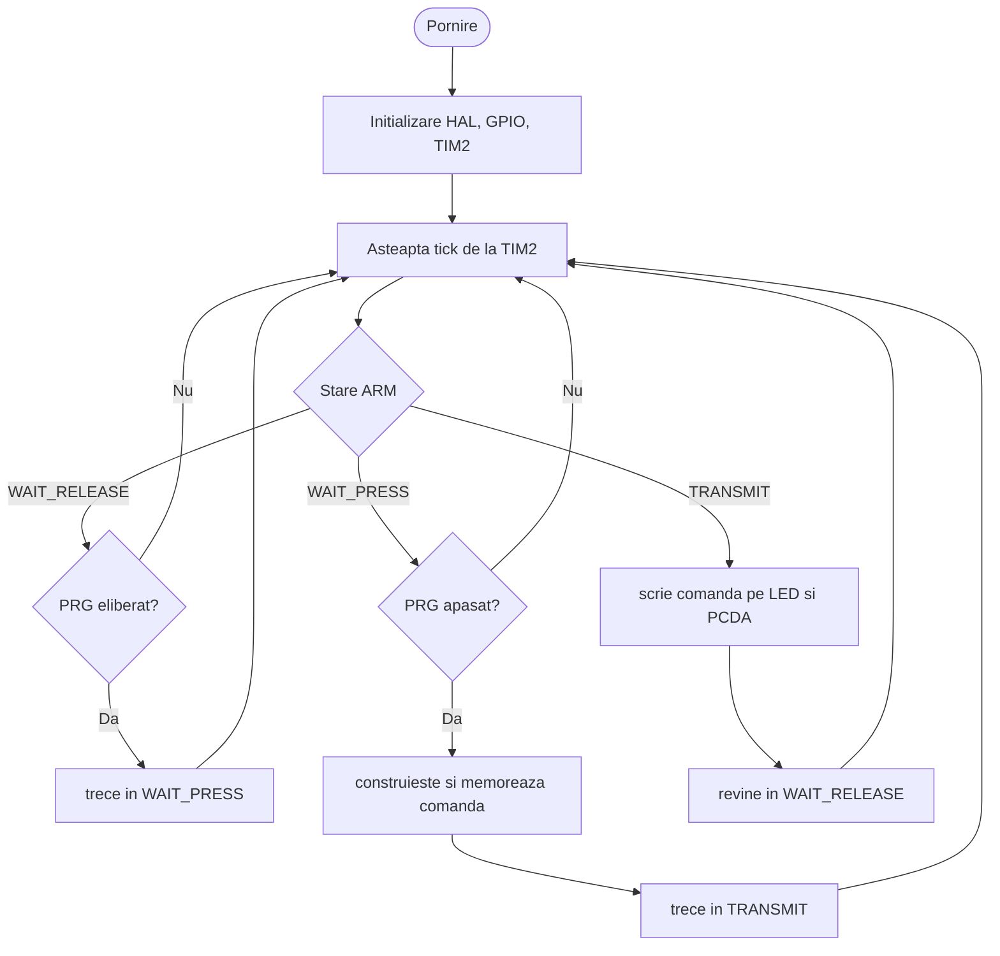
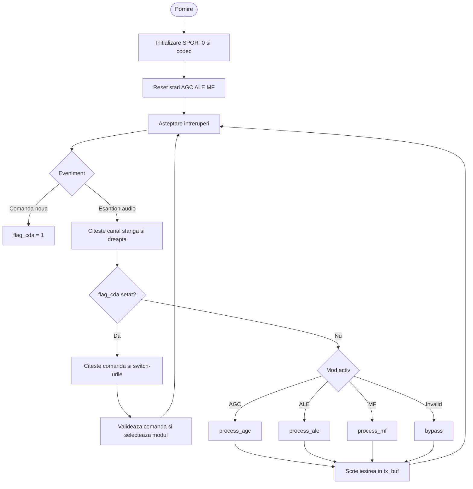
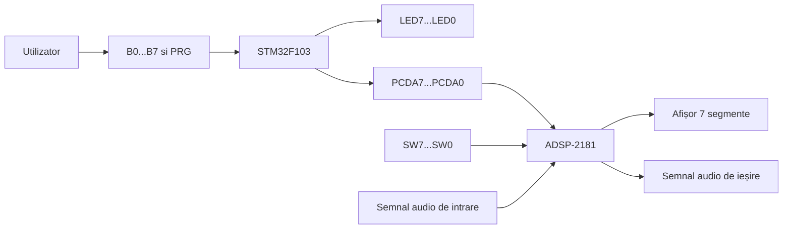

# Diagrame V3

## Organigrama ARM

```mermaid
flowchart TD
    A0([Pornire]) --> A1[Initializare HAL, GPIO, TIM2]
    A1 --> A2[Asteapta tick de la TIM2]
    A2 --> A3{Stare ARM}
    A3 -->|WAIT_RELEASE| A4{PRG eliberat?}
    A4 -->|Nu| A2
    A4 -->|Da| A5[trece in WAIT_PRESS]
    A5 --> A2
    A3 -->|WAIT_PRESS| A6{PRG apasat?}
    A6 -->|Nu| A2
    A6 -->|Da| A7[construieste si memoreaza comanda]
    A7 --> A8[trece in TRANSMIT]
    A8 --> A2
    A3 -->|TRANSMIT| A9[scrie comanda pe LED si PCDA]
    A9 --> A10[revine in WAIT_RELEASE]
    A10 --> A2
```

## Organigrama DSP

```mermaid
flowchart TD
    D0([Pornire]) --> D1[Initializare SPORT0 si codec]
    D1 --> D2[Reset stari AGC ALE MF]
    D2 --> D3[Asteptare intreruperi]
    D3 --> D4{Eveniment}
    D4 -->|Comanda noua| D5[flag_cda = 1]
    D4 -->|Esantion audio| D6[Citeste canal stanga si dreapta]
    D6 --> D7{flag_cda setat?}
    D7 -->|Da| D8[Citeste comanda si switch-urile]
    D8 --> D9[Valideaza comanda si selecteaza modul]
    D9 --> D3
    D7 -->|Nu| D10{Mod activ}
    D10 -->|AGC| D11[process_agc]
    D10 -->|ALE| D12[process_ale]
    D10 -->|MF| D13[process_mf]
    D10 -->|Invalid| D14[bypass]
    D11 --> D15[Scrie iesirea in tx_buf]
    D12 --> D15
    D13 --> D15
    D14 --> D15
    D15 --> D3
```

## Fluxul complet al sistemului

```mermaid
flowchart LR
    U[Utilizator] --> B[B0...B7 si PRG]
    B --> ARM[STM32F103]
    ARM --> LED[LED7...LED0]
    ARM --> PCDA[PCDA7...PCDA0]
    PCDA --> DSP[ADSP-2181]
    SW[SW7...SW0] --> DSP
    IN[Semnal audio de intrare] --> DSP
    DSP --> DISP[Afișor 7 segmente]
    DSP --> OUT[Semnal audio de ieșire]
```
