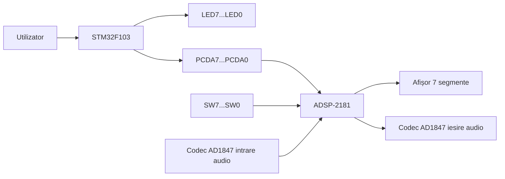
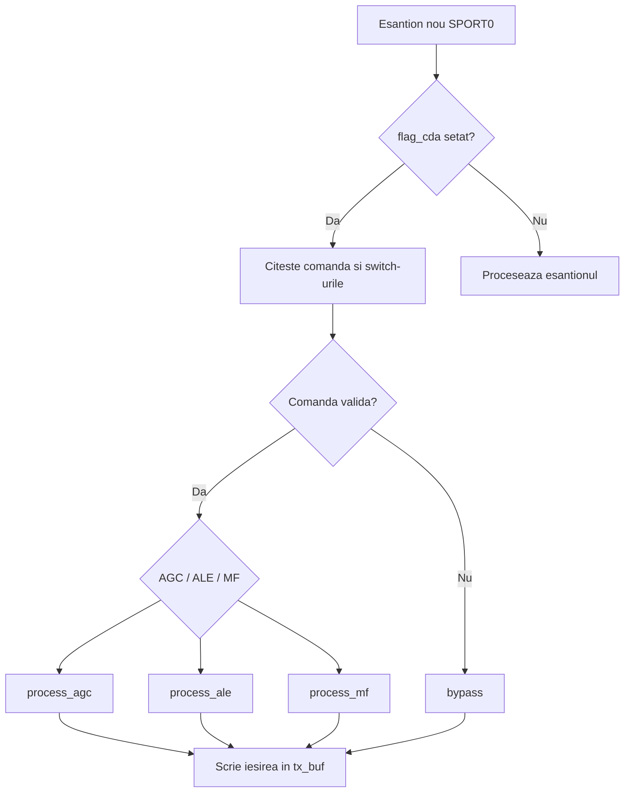

# RAPORT V3

## 1. Cerinta proiectului

Sistemul trebuie sa implementeze arhitectura din `Tema P2-2026.pdf`:

- subsistem ARM bazat pe `STM32F103`
- subsistem DSP bazat pe `ADSP-2181`
- trei functii de prelucrare: `AGC`, `ALE`, `MF`
- afisarea starii pe ambele subsisteme
- testare in `STM32CubeIDE`, `VisualDSP++ 3.5` si prin simulare

In `v3` este pastrata o varianta completa a proiectului, nu doar fisiere izolate cu modificari:

- proiectul STM32 complet: `v3/test_P2_STM32_2026/test`
- proiectul DSP complet: `v3/DSP test/DSP test/test_ext`
- fisierele MATLAB pentru simulare: `v3/Exemple prelucrari de semnal/Exemple prelucrari de semnal/matlab`
- sursele PDF folosite la analiza: `v3/documentatie/surse_pdf`

## 2. Surse folosite

Documente de referinta:

- `Tema P2-2026.pdf`
- `Setarea intreruperilor.pdf`
- `IO Streams Simulating.pdf`
- `Interrupts Simulating.pdf`
- `plot.pdf`
- `adsp21xx._instruction_set.pdf`
- `05-1.pdf`
- `15-1.pdf`

Rolul lor in varianta `v3`:

- `Tema P2-2026.pdf` este documentul principal pentru cerinta.
- `Setarea intreruperilor.pdf` fixeaza utilizarea lui `TIM2` si a callback-ului `HAL_TIM_PeriodElapsedCallback()`.
- documentele VisualDSP stabilesc pasii de simulare pentru stream-uri, intreruperi si plot.
- `05-1.pdf` si `15-1.pdf` au fost tratate ca documentatii auxiliare, nu ca adevar absolut, deoarece contin si parti incomplete sau contradictorii.

## 3. Arhitectura sistemului

Sistemul este separat in doua subsisteme:

- subsistemul ARM genereaza si transmite comenzi
- subsistemul DSP decodeaza comanda, citeste parametrii si proceseaza semnalul audio

## 4. Subsistemul ARM

### 4.1 Rol

ARM-ul are trei sarcini:

- citeste intrarile `B0...B7`
- detecteaza momentul de transmitere prin `PRG`
- afiseaza si transmite comanda pe `LED7...LED0` si `PCDA7...PCDA0`

### 4.2 Implementare

Fisier principal:

- `v3/test_P2_STM32_2026/test/Core/Src/main.c`

Configurarea hardware este pastrata in:

- `v3/test_P2_STM32_2026/test/test.ioc`

Timerul `TIM2` face esantionarea periodica a intrarilor, conform cerintei si notelor din `Setarea intreruperilor.pdf`.

### 4.3 Masina de stari ARM

Logica este implementata cu trei stari:

1. `ARM_STATE_WAIT_RELEASE`
2. `ARM_STATE_WAIT_PRESS`
3. `ARM_STATE_TRANSMIT`

Secventa este:

1. se asteapta eliberarea lui `PRG`
2. se asteapta apasarea lui `PRG`
3. se transmite comanda catre DSP si se afiseaza pe LED-uri

### 4.4 Corectie introdusa in `v3`

In `v3`, comanda este memorata exact in momentul detectarii apasarii lui `PRG`.

Motiv:

- in varianta anterioara, comanda putea fi transmisa cu un esantion citit mai tarziu
- daca utilizatorul modifica butoanele intre doua tick-uri de timer, DSP-ul putea primi alta valoare decat cea intentionata

Solutia folosita:

- `g_pendingCommand` retine valoarea blocata la apasarea lui `PRG`
- functia `ARM_BuildCommand()` forteaza `D7` si `D6` pe `1`
- `ARM_TransmitCommand()` transmite exact octetul memorat

### 4.5 Structura comenzii ARM -> DSP

Varianta pastrata in `v3` este cea coerenta cu codul DSP integrat si cu exemplele de comenzi deja folosite:

- `D7 D6 = 11` pentru validare
- `D3 = canal`
- `D2..D0 = ID functie`
- `D5 D4` sunt tratati ca rezervati in implementarea curenta

Exemple:

- `0xC0` = `AGC`, stanga
- `0xC1` = `ALE`, stanga
- `0xC2` = `MF`, stanga
- `0xC8` = `AGC`, dreapta
- `0xC9` = `ALE`, dreapta
- `0xCA` = `MF`, dreapta

## 5. Subsistemul DSP

### 5.1 Rol

DSP-ul:

- initializeaza codec-ul `AD1847`
- lucreaza pe `SPORT0`
- primeste comanda de la ARM
- citeste parametrii din `SW7...SW0`
- aplica algoritmul selectat pe canalul ales

### 5.2 Implementare

Fisier principal:

- `v3/DSP test/DSP test/test_ext/test_ext.asm`

Proiectul VisualDSP++ este complet in:

- `v3/DSP test/DSP test/test_ext/test_ext.dpj`
- `v3/DSP test/DSP test/test_ext/ADSP-2181.ldf`
- `v3/DSP test/DSP test/test_ext/test_ext.mak`

### 5.3 Initializare

Codul:

- configureaza `SPORT0`
- incarca secventa de initializare pentru codec
- asteapta finalizarea auto-calibrarii
- initializeaza starile pentru `AGC`, `ALE` si `MF`
- configureaza porturile de program flag pentru comunicarea cu extensia IO DSP

### 5.4 Logica DSP

Doua evenimente sunt importante:

- o intrerupere asincrona de comanda, care seteaza `flag_cda`
- rutina de intrare audio, care preia esantioanele si decide daca decodeaza o comanda noua sau proceseaza semnalul curent

Fluxul logic este:

### 5.5 Parametrii DSP

#### AGC

- `SW7..SW6` aleg `REF`
- `SW5..SW4` aleg lungimea ferestrei `M`
- `SW3..SW2` aleg `mu`

#### ALE

- `SW7..SW6` aleg intarzierea `D`
- `SW5..SW4` aleg amplitudinea zgomotului `a`
- `SW3..SW2` aleg `mu`
- `SW1..SW0` aleg `lambda`

#### MF

- `SW1..SW0` aleg `K`
- fereastra rezultata este `W = 2K + 1`

### 5.6 De ce a fost pastrat acest DSP in `v3`

Am pastrat implementarea integrata curenta pentru ca:

- `05-1.pdf` lasa functiile DSP la nivel de bypass sau `TODO`
- `15-1.pdf` descrie o idee mai avansata, dar intra in conflict cu maparea coerenta deja folosita in comanda
- codul din `test_ext.asm` este in momentul de fata cea mai completa varianta functionala din proiect

## 6. Simulari MATLAB

Fisiere:

- `v3/Exemple prelucrari de semnal/Exemple prelucrari de semnal/matlab/test_AGC.m`
- `v3/Exemple prelucrari de semnal/Exemple prelucrari de semnal/matlab/test_ALE.m`
- `v3/Exemple prelucrari de semnal/Exemple prelucrari de semnal/matlab/test_MF.m`

Ce s-a corectat in `v3`:

- scripturile nu mai depind de directorul curent
- se folosesc cai relative la folderul scriptului
- `test_ALE.m` foloseste fisierul corect `input_ALE.dat`
- dimensiunea datelor este dedusa din fisierul incarcat

Aceste scripturi sunt utile pentru:

- validarea intuitiva a algoritmilor
- comparatia intre semnal de intrare si semnal procesat
- verificarea parametrilor inainte de testarea pe DSP

## 7. Fisiere importante din `v3`

### Proiect STM32

- `v3/test_P2_STM32_2026/test/Core/Src/main.c`
- `v3/test_P2_STM32_2026/test/Core/Inc/main.h`
- `v3/test_P2_STM32_2026/test/test.ioc`

### Proiect DSP

- `v3/DSP test/DSP test/test_ext/test_ext.asm`
- `v3/DSP test/DSP test/test_ext/test_ext.dpj`
- `v3/DSP test/DSP test/test_ext/ADSP-2181.ldf`

### Simulari MATLAB

- `v3/Exemple prelucrari de semnal/Exemple prelucrari de semnal/matlab/test_AGC.m`
- `v3/Exemple prelucrari de semnal/Exemple prelucrari de semnal/matlab/test_ALE.m`
- `v3/Exemple prelucrari de semnal/Exemple prelucrari de semnal/matlab/test_MF.m`

### Documentatie

- `v3/README.md`
- `v3/ANALIZA_MODIFICARI.md`
- `v3/documentatie/RAPORT_V3.md`
- `v3/documentatie/surse_pdf`

## 8. Pasi de rulare

### 8.1 STM32CubeIDE

1. Deschide proiectul din `v3/test_P2_STM32_2026/test`.
2. Verifica fisierele generate si configurarea din `test.ioc`.
3. Fa `Build`.
4. Programeaza placa STM32.

### 8.2 VisualDSP++ 3.5

1. Deschide `v3/DSP test/DSP test/test_ext/test_ext.dpj`.
2. Selecteaza configuratia `Debug`.
3. Fa `Build`.
4. Incarca executabilul in simulator sau pe placa.
5. Configureaza stream-urile si intreruperile dupa documentele din `surse_pdf`.

### 8.3 MATLAB

1. Deschide folderul `v3/Exemple prelucrari de semnal/Exemple prelucrari de semnal/matlab`.
2. Ruleaza `test_AGC.m`, `test_ALE.m` sau `test_MF.m`.
3. Analizeaza graficele rezultate si fisierele text generate.

## 9. Observatii finale

- `v3` este acum o varianta completa de proiect, nu doar un pachet de patch-uri.
- Documentatia noua a fost folosita critic, nu copiata orb.
- Cerinta de baza este mentinuta dupa `Tema P2-2026.pdf`.
- Deciziile de proiect care se abat de la rapoartele auxiliare sunt explicate in `ANALIZA_MODIFICARI.md`.

## 10. Limitari de verificare in acest mediu

- nu am putut rula build-ul STM32 aici, deoarece toolchain-ul nu este disponibil in PATH
- nu am putut recompila DSP-ul aici, deoarece VisualDSP++ necesita mediul si licenta locala
- din acest motiv, validarea finala completa trebuie facuta in IDE-urile folosite la laborator
